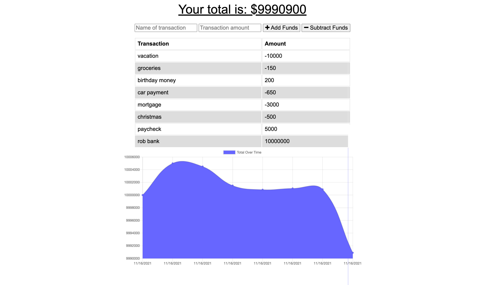

# PWA-online_offline_budget_tracker

## Link to deployed app:
https://sl-budget-tracker.herokuapp.com/

## Description
Budget Tracker application that allows for offline access and functionality. The user will be able to add expenses and deposits to their budget with or without a connection. When entering transactions offline, they can populate the total when brought back online.

Offline Functionality:

  * Enter deposits offline

  * Enter expenses offline

When brought back online:

  * Offline entries added to tracker.

## User Story
AS AN avid traveller
I WANT to be able to track my withdrawals and deposits with or without a data/internet connection
SO THAT my account balance is accurate when I am traveling

## Installation

To run this on your server with node.js, install all npm packages:
        npm i

## NPM Packages
Packages needed to run components of this application: express and mongoose.
- [Express](https://www.npmjs.com/package/express)
- [Mongoose](https://www.npmjs.com/package/mongoose)
- [Compression](https://www.npmjs.com/package/compression)
- [dotenv](https://www.npmjs.com/package/dotenv)

## Usage 
A web application that dynamically interacts with either an online database or indexedDB when offline with cached data.  

## License
